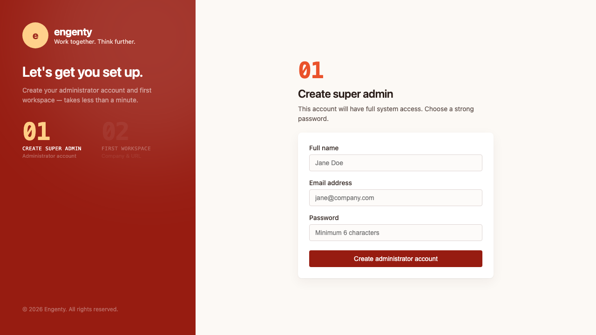

```txt

███████╗███╗   ██╗ ██████╗ ███████╗███╗   ██╗████████╗██╗   ██╗
██╔════╝████╗  ██║██╔════╝ ██╔════╝████╗  ██║╚══██╔══╝╚██╗ ██╔╝
█████╗  ██╔██╗ ██║██║  ███╗█████╗  ██╔██╗ ██║   ██║    ╚████╔╝ 
██╔══╝  ██║╚██╗██║██║   ██║██╔══╝  ██║╚██╗██║   ██║     ╚██╔╝  
███████╗██║ ╚████║╚██████╔╝███████╗██║ ╚████║   ██║      ██║   
╚══════╝╚═╝  ╚═══╝ ╚═════╝ ╚══════╝╚═╝  ╚═══╝   ╚═╝      ╚═╝   
```

# People & Agents. As One Team.

Agents side by side with your team
 — not stuck in a terminal window.

> engenty is early preview - we do not guarantee data migrations

## Run it locally

```bash
git clone https://github.com/engenty/engenty.git
cd engenty
```

**Prerequisites** — skip any step you already have:

```bash
# Node 24 (.nvmrc pins v24.14.0)
nvm install
nvm use
corepack enable          # once per machine — pnpm 10.23 from package.json

# Docker-compatible daemon so `docker info` succeeds
# macOS: Docker Desktop, OrbStack, or Dory (pnpm can auto-start these)
# Linux: Docker Engine — if the daemon is already running, you are done
```

The Supabase CLI ships as a workspace dependency. `pnpm install` is enough; do not install it globally.

Then three commands:

```bash
pnpm install                 # deps + warm the workspace build
pnpm engenty setup --local   # compose DB/UI artifacts, start Supabase, write .env.local
pnpm dev                     # core + ui + ai + docs
```

Open **http://localhost:5173**. First visit is `/initial_setup` — create the administrator account and first workspace:



Copilot chat needs a [Vercel AI Gateway](https://vercel.com/docs/ai-gateway) key (the env wizard asks). Everything else can come up without it. `setup --local` is safe to re-run.

The Setup:

 * Based on **[Mastra](https://mastra.ai/)** as the agent framework
 * Using **[AG-UI](https://ag-ui.com/)** to integrated seamless with the UI
 * Modulare to the core - based on a plugin architecture
 * Batteries included - ships with basic modules and a powerful knowledge-base with ingestions and RAG
 * Runs on your own infrastructure using **[Supabase](https://supabase.com/)** and **[Hono](https://hono.dev/)** - currently using **[Vercel Gateway](https://vercel.com/docs/ai-gateway)** as the LLM router


## Modules

engenty ships with a basic set of modules out of the box — each one is an installable plugin (see [Modules: on disk vs active](#modules-on-disk-vs-active)). Use them as building blocks, reference or in real life.

engenty is strictly modular. So you can add your own modules using the PluginsSDK.

| Module | What it does |
|--------|--------------|
| Company Profile | Legal entity profile and business identity settings |
| Contacts | Contacts and organisations module |
| Copilot | Full-page AI chat, backed by `apps/ai` |
| Knowledge Base | Articles, tags, FAQs, and AI-powered assistants |
| Projects | Project management with phases, tasks, and client portal |
| Tasks | Canonical goals and tasks for human and agent collaboration |
| Team | Team directory, org structure, groups, and taxonomies |
| Time Tracking | Weekly time tracking for project, phase, and task work |

## Repo Layout

Here's how the workspace is organized:

| Path | What it is |
|------|------------|
| `apps/core` | Hono backend, HTTP API and plugin host |
| `apps/ui` | React based web frontend |
| `apps/ai` | Agent runtime based on Mastra and AG-UI |
| `apps/docs` | Documentation site |
| `packages/*` | Shared libraries and plugin SDK |
| `modules/*` | Installable feature modules - using a plugin architecture |
| `scripts/*` | Root dev tooling (DB sync, migrations, Portless, clean, purge) |
| `supabase/*` | Local Postgres + auth config and migrations |
| `test/*` | Global Vitest setup and test defaults |

## Database / Hosting

One Postgres/Supabase project backs the whole product, on your own infrastructure; 

Each active module owns its own `supabase/migrations` and storage buckets (declared in `engenty.plugin.json`); `pnpm engenty setup` composes them into that one config and migrations tree, and `pnpm db:migrate` applies changes.

## Authentication / Authorization

**[Supabase Auth](https://supabase.com/docs/guides/auth)** handles sign-in (email/password, magic link, OTP) — verified server-side in `apps/core/src/security`. Additional providers (OAuth, SSO) are on the roadmap.

**RBAC Authorization**: a per-tenant role (currently `admin`/`member`). Tenant isolation is enforced at the DB layer via Postgres Row Level Security. Today's roles by concept simple — a more granular permission model is planned.

## i18n

Built on **[i18next](https://www.i18next.com/)** (`@engenty/i18n`), namespaced per module — every module ships `en`/`de` locales, enforced by convention. Language is a persisted user/tenant setting, switchable at runtime.

## Develop

Vite serves the UI on **http://localhost:5173** and proxies `/api`, `/ai`, `/docs`
to the other apps.

**Every day:**

```bash
pnpm dev                                # start the whole stack
pnpm engenty setup && pnpm db:migrate   # ONLY after changing installed modules or SQL (new schemas need a Supabase restart)
```

**Keep the local stack lean.** A local Supabase is a dozen containers, and the two
heaviest at idle are not the database: Supabase Studio (plus the gateway traffic it
generates) and the Logflare/Vector log pipeline that powers Studio's Logs tab. Both are
off by default — measured together they cost well over ten times what Postgres does, and
with two or three worktree stacks up they saturate the machine (the symptom is not "slow":
auth stops answering and the app reports `Unauthorized`).

```bash
pnpm db:up                   # lean — no Studio, no log pipeline
pnpm db:up --studio          # + Supabase Studio (the table browser)
pnpm db:up --logs            # + Logflare/Vector (Studio's Logs tab)
```

Stop the stack first (`pnpm supabase:stop`) if it is already running — the flags are
written into `supabase/config.toml`, which is read at start.

**Before you commit** (this is exactly what CI checks — see [Release & ship](#release--ship)):

```bash
pnpm check       # lint + format   (pnpm fix auto-fixes)
pnpm typecheck
pnpm test
```

`pnpm dev` runs `dev:check` + `predev` first (Docker/Supabase checks, builds
packages/modules, regenerates UI plugin artifacts). Each module/package is its own
workspace member with its own `build` / `test`.

**When stuck:** `pnpm purge` (full local reset, keeps data) · `pnpm db:reset`
(⚠️ **wipes all local data**).

### Optional: HTTPS via Portless (recommended)

For production-like local URLs, use [Portless](https://github.com/vercel-labs/portless):

```bash
pnpm portless:setup      # once — trust CA + sync HTTPS URLs to .env.local
pnpm portless            # once per session — HTTPS proxy on :443 (sudo, Terminal.app)
pnpm dev:portless        # env sync + routes + dev stack
```

Open **https://engenty.localhost**. Parallel worktrees: `pnpm dev:portless --domain=<name>`.

**Mastra Studio is opt-in**, in both modes — it is a second dev server most runs never
look at. Add `--studio` (or use `pnpm dev:studio` without Portless):

```bash
pnpm dev:portless --domain=<name> --studio
```

Note this is a different thing from *Supabase* Studio above: one is a node process, the
other a container in the Supabase stack.
See [docs/dev/portless-local-urls.md](./docs/dev/portless-local-urls.md).

| App | URL |
|-----|-----|
| Main (UI + API gateway) | https://engenty.localhost |
| App Backend (Hono) | https://engenty.localhost/api |
| Agent Backend | https://engenty.localhost/ai |
| Docs | https://engenty.localhost/docs |
| Mastra Studio | https://engenty.localhost/studio — only with `--studio`, see below |
| OpenAPI (Scalar) | https://engenty.localhost/api/docs |

Direct upstream (debug): https://ai.engenty.localhost · https://docs.engenty.localhost

Use the same browser origin as your env block (`pnpm dev:urls:localhost` vs
`pnpm dev:urls:portless`).

`.env.example` is generated from the env manifest (`pnpm env:example:write`); `pnpm dev:env:check`
validates your local env against it.

## Production

Self-host behind a single HTTPS domain with [Coolify](https://coolify.io/) and a
Supabase project (cloud or self-hosted). That is a separate path from local
`pnpm dev` — VPS, domain, TLS, and production secrets.

Walkthrough: [docs/content/setup/coolify.md](docs/content/setup/coolify.md).
Operator reference: [deploy/DEPLOY.md](deploy/DEPLOY.md).

## Release & ship

Two steps: cut the release, then push it. **Pushing the `v*` tag is what builds and deploys** — a plain push to `main` never does.

```bash
pnpm release                        # interactive: bump + changelog + commit + annotated tag vX.Y.Z (local only)
git push origin main --follow-tags  # push the commit AND the tag → triggers build + deploy
```

- **`pnpm release`** (git-cliff over [Conventional Commits](https://www.conventionalcommits.org)) is the **single source of truth** — it writes `CHANGELOG.md` + `changelog.json`, bumps `package.json`, commits `chore(release): vX.Y.Z`, and creates the tag. Never hand-edit those files or tags. Use `pnpm release:changelog` to draft the changelog only.
- **Pushing the tag** triggers [`build-images.yml`](.github/workflows/build-images.yml): it builds the `edge` / `ai` / `sandbox` images, pushes them to GHCR, then triggers the Coolify deploy.
- **Pushing `main` (no tag)** runs CI only — lint, typecheck, test (`ci.yml`). No build, no deploy.

Full details: [docs/content/dev/releases-and-versioning.md](docs/content/dev/releases-and-versioning.md).

## Modules: in repo, wired (installed) and activation

**Goal:** one declared product stack. Apps (`apps/core`, `apps/ui`, `apps/ai`) must not hard-code which modules exist — only **`engenty.plugins`** does.

| State | Where | Meaning |
|-------|--------|---------|
| **On disk** | `modules/<slug>/` in git | Source is in the repo; pnpm sees it via `workspaces: ["modules/*"]`. **Not running** until activated. |
| **Active** | root `package.json` → **`engenty.plugins`** | Object map (pi-style) declaring which plugins this product runs. SSOT for backend, DB, UI catalog, Supabase compose. |
| **Derived** | gitignored or setup-written | `supabase/config.toml`, aggregated migrations, `generated-catalog.ts`, and (when needed) `@engenty/*` entries in `apps/ui/package.json` — all produced by **`pnpm engenty setup`**, not edited by hand. |


```bash
pnpm engenty plugins install <slug>  # add to engenty.plugins + setup + UI dep sync
pnpm db:migrate                      # if the module has SQL
pnpm dev
```

**If you remove a module from the product** (folder can stay on disk):

```bash
pnpm engenty plugins uninstall <slug>
pnpm dev
```

Commands: `pnpm engenty plugins install|uninstall|list`

## License

[FSL-1.1-MIT](./LICENSE) — free for any non-competing use, converting to MIT two
years after each release.
