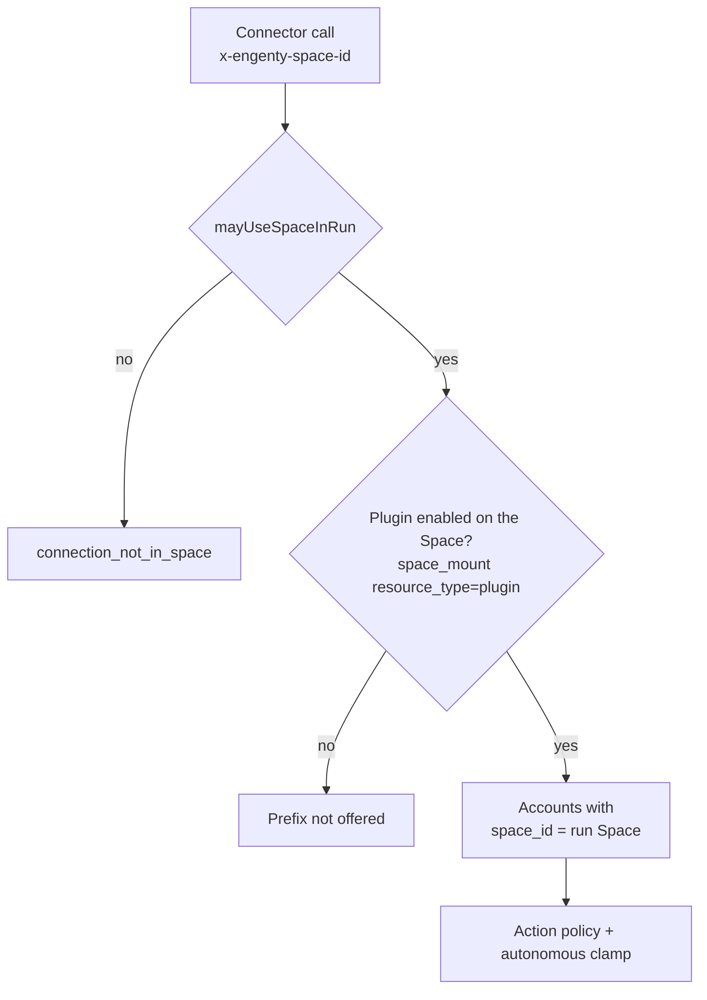

# Connections

The connections framework is the one central mechanism for connecting external
services (Gmail, Google Drive, Outlook, Slack, …) to Engenty. It owns OAuth,
token custody, and a per-action permission model — connector modules only
*declare* a service's actions and never touch tokens or approval logic.

Working design notes in `docs/wip/connections-framework.md` predate
Space-owned connections; this page is the stable developer reference.

## Architecture

```
packages/connections-sdk                 @engenty/connections-sdk — shared types + runtime
modules/connections                      framework module: schema, OAuth routes,
                                         management operations, policy gate, UI
modules/connections/providers/google       connectors: google-gmail, google-drive,
                                           google-calendar, google-contacts
modules/connections/providers/microsoft    connectors: microsoft-outlook, microsoft-onedrive
modules/connections/providers/slack        connector: slack
modules/connections/providers/hubspot      connector: hubspot (api_key / private app)
modules/connections/providers/s3           connector: s3 (api_key auth, files capability)
modules/connections/providers/local-files  connector: local-files (browser auth, FSA bridge)
modules/connections/providers/external     tenant-scoped imported OpenAPI/MCP connectors
```

Connector providers are **nested workspace plugins** under
`modules/connections/providers/*`. Each is its own package (`@engenty/connections-<provider>`)
with its own `engenty.plugin.json` — the manifest `id` (e.g. `connections-google`)
is the slug used in the root `engenty.plugins` map and for enable/disable.
Nesting is discovered by convention (only the literal `providers/` segment is
scanned one level deeper); a nested provider **must** declare an explicit `id`
and its `package.json` name must equal `@engenty/<id>`.

A **connector** is a `ConnectorDefinition`: an OAuth2 config plus a list of
**actions**. Each action is projected as a regular module operation
(`<toolPrefix>_<actionId>`, e.g. `gmail_search_threads`), so everything
downstream — the API catalog, agent tools, Code Mode `external_*` stubs, the
approval gate, audit — works unchanged.

**Tokens never leave the app plane.** They are AES-256-GCM encrypted at rest
(`CONNECTIONS_TOKEN_ENC_KEY`) in `module_connections.connections`, the
encrypted columns are excluded from the `authenticated` column grant, and the
only decryption path is the repo's `withFreshAccessToken` helper (which also
transparently refreshes). Agents — chat, task jobs, and sandboxed Code Mode
programs — call tools; the provider request is made host-side in core.

## Action groups and the static contract

Every action belongs to a group, and the group fixes the operation contract:

| Group         | Contract                                            | Effect |
| ------------- | --------------------------------------------------- | ------ |
| `read`        | `idempotent: true`, risk `low`, no approval         | `readOnly` ⇒ callable from Code Mode |
| `write`       | risk `medium`, `requiresApproval: true`             | chat suspends for approval |
| `destructive` | risk `high`, `requiresApproval: true`               | send / delete / trash |

`readOnly` is *derived* (`idempotent && low && !requiresApproval` — see
`buildOperationContracts` in core), so classifying an action honestly is what
makes it available (or not) to Code Mode.

## The permission model — reach, action policy, run context

A **plugin** is a connector definition (builtin Gmail, or a tenant-imported
OpenAPI/MCP surface). A **connection** is one authenticated account on that
plugin (`module_connections.connections`). It belongs to one **Space**
(`space_id`, FK `core.spaces`, cascade). `connected_by` records who signed in
— audit only, it grants no access and no approval right.

Effective policy for one call is **reach first**, then action policy, then
unattended clamps.



1. **Account reach** — decided *before* `resolveConnectionActionPolicy` (see
   `isAccountReachableInRun` and `connectorPrefixesForAgent` in
   `@engenty/connections-sdk`). An account is reachable iff
   `connection.space_id` equals the run's Space. A run that names no Space
   reaches no account (`connection_not_in_space`). Every member and agent of
   the Space shares its accounts; there is no per-agent grant and no
   "every space" flag.

   | Question | Stored as |
   | --- | --- |
   | Is this service on the Space? | `core.space_mount` `resource_type = 'plugin'`, `resource_key` = connector id. Enables the prefix before any account exists ("added, needs authentication"). |
   | Which mailbox? | `module_connections.connections.space_id` = the run's Space |

   The Space a call names (`x-engenty-space-id`) is a claim, verified by
   `mayUseSpaceInRun` (`packages/connections-sdk/src/space-mounts.ts`): a
   person must be able to enter the Space (`canEnterSpace`; tenant admins
   enter all); an agent or service principal may use an open Space, or the
   Space of its own routine (`x-engenty-trigger-id`) or task
   (`x-engenty-task-id`), read from that row. Unreadable → no.

   An agent's preferred plugin list (`ai.engenty_ai_agents.connector_ids`)
   only narrows what the Space offers. Empty = every plugin enabled on the
   Space. It never adds an account.

   The copilot always runs out of the caller's personal Space (`/s/me`), so
   its accounts are the personal Space's wherever it is opened — see
   [Connectors in a Space, on an agent, and on the copilot river](#connectors-in-a-space-on-an-agent-and-on-the-copilot-river).

2. **Action policy** — `allow | ask | deny` per action, resolved in
   `resolveConnectionActionPolicy`. Resolution order: action-id override →
   group override (`group:<name>`) → group default (`read → allow`,
   `write`/`destructive → ask`). Overrides are stored per connection in
   `module_connections.connection_action_policies` and edited in the UI
   matrix (Settings → Connections).

3. **Run context** — per connection `autonomous_mode: off | read_only | full`
   clamps what agent/service principals may do when no user is present.

**Connecting** requires a Space: OAuth (`GET /api/connections/:connectorId/connect?space_id=…`),
API-key (`connect_credentials`) and local-files connects all take the Space
(the UI sends the active one, `/s/me` when none), check the caller may enter
it, and stamp it on the row. One account per
`(tenant_id, space_id, connector_id, external_account)`; the same mailbox
may be connected in two Spaces as two rows.

**Managing** a connection (settings, policy matrix, disconnect) and deciding
its approvals: owners of its Space — the personal Space's owner, or a
`space_member` with role `owner` — and tenant admins (`core.users.manage`).

RLS for authenticated members: accounts of Spaces they can enter (owner or
`space_member`). Encrypted token columns stay off the authenticated grant.

### Where each axis is enforced

There is exactly **one authoritative gate**: an async profile policy the
connections module registers in core (`registerProfilePolicy`), evaluated on
every operation invoke:

- `deny` outcomes (no Space, a Space the call may not use, account not owned
  by the run's Space, autonomous clamps, user-configured deny) → HTTP 403 for
  *every* principal type.
- `ask` for **user principals** → the policy returns `null`; the AI-side
  pre-gate owns the chat UX (native tool-level suspend/resume, invoker
  approves). Durable "always allow" from the connections UI is merged into the
  run's approval grants at run start (`connections_granted_operations`), so
  the Approve card is skipped for those.
- `ask` for **autonomous principals** (task jobs, triggers, engenty Apps) →
  the policy returns `require_approval` with `space_id` (the account's Space)
  in the approval context; core's approval gate consumes a standing grant or
  files one request in `core.approval_requests` and returns 202
  `approval_required`. Task jobs run with the AI-side
  `approvalPolicy: "defer"`, which shapes the 202 into a structured
  `approval_pending` tool result plus a tenant-inbox notification
  (`connection_approval_requested`). Core lets only that Space's owners or a
  tenant admin decide it
  (`apps/core/src/api/routes/plugins/module-operation-approvals.ts`) —
  "Approve always" also writes an `allow` override so the retry passes.
- `allow` overrides → the policy returns an explicit allow, which bypasses
  core's default approval requirement for non-user principals.

Defense in depth: the connector runtime re-checks reach and policy before
executing, so a route that skipped the policy layer still cannot run a denied
action.

## Building a connector module

A connector module is a nested workspace plugin that declares one or more
connectors. See `modules/connections/providers/slack` for the smallest complete
example.

1. **Scaffold** `modules/connections/providers/<provider>/` with
   `engenty.plugin.json` (`kind: "module"`, `capabilities.operations: true`, an
   explicit `id` of `connections-<provider>`), `package.json` (name
   `@engenty/connections-<provider>`, depends on `@engenty/connections-sdk`,
   `tsconfig.json` extending `../../../../tsconfig.base.json`), and register the
   slug in the root `package.json` `engenty.plugins` map. `pnpm engenty plugins
   create` still scaffolds flat `modules/<slug>/` only, so nested provider
   scaffolds are currently manual.
2. **Define the connector**:

```ts
import { defineConnector, registerConnectorModule } from "@engenty/connections-sdk";
import { z } from "zod";

export const myConnector = defineConnector({
  id: "my-service",            // kebab-case, unique
  moduleId: "connections-my-service",
  toolPrefix: "mysvc",         // operations become mysvc_<action>
  name: "My Service",
  description: "…",
  icon: "🔌",                  // emoji renders; anything else falls back to a glyph
  auth: {
    kind: "oauth2",
    oauth2: {
      authUrl: "https://…/authorize",
      tokenUrl: "https://…/token",
      clientIdEnv: "MYSVC_OAUTH_CLIENT_ID",
      clientSecretEnv: "MYSVC_OAUTH_CLIENT_SECRET",
      baseScopes: ["openid", "email"],
      resolveAccount: async (token, fetchImpl) => ({ label: "…" }),
    },
  },
  actions: [
    {
      id: "search_items",
      group: "read",
      summary: "Search items",
      description: "…",
      providerScopes: ["items.readonly"],
      inputSchema: z.object({
        query: z.string().describe("Search query"),
      }),
      handler: async (input, ctx) => {
        const res = await ctx.fetchImpl("https://api…/search", {
          headers: { authorization: `Bearer ${ctx.accessToken}` },
        });
        if (!res.ok) throw new Error(`mysvc_api_error (${res.status})`);
        return /* compact mapped JSON, not the raw payload */;
      },
    },
  ],
});
```

3. **Register** in `src/plugin.ts`:

```ts
const plugin: EngentyPluginFactory = (engenty) => {
  registerConnectorModule(engenty, myConnector);
};
export default plugin;
```

4. **Document env vars** via the `env` block in `engenty.plugin.json` (the
   `engenty env` helper discovers it), then run `pnpm env:example:write`.

That's everything — OAuth routes, the settings/admin UI, policy enforcement,
approvals, and token refresh come from the framework. No migration is needed
unless the module stores its own data.

Handler conventions: use `ctx.accessToken` + `ctx.fetchImpl`, throw
`<provider>_api_error (<status>): <excerpt>` on failure, `.describe()` every
input field (it becomes the tool's JSON schema), cap list sizes and long
bodies, and return mapped, compact JSON.

## OAuth setup

The generic flow is
`GET /api/connections/:connectorId/connect` → `{ authUrl }` → provider →
`GET /api/connections/oauth/callback` (public, nonce-validated, 10 min TTL).
Register `<ENGENTY_API_BASE_URL>/api/connections/oauth/callback` as the
redirect URI with each provider (override with `CONNECTIONS_REDIRECT_URI`
behind a proxy). Required env per provider is documented in `.env.example`
(Google Cloud Console, Azure App registrations, api.slack.com).

Every connector shares that one callback route, so a provider only ever needs
this single redirect URI — not one per connector. **Setup → Platform settings**
resolves the placeholder against the running installation and shows the literal
URL with a copy button next to each OAuth group, so you do not have to assemble
it by hand. The app origin on its own is not a valid redirect URI, though Google
additionally wants it under "Authorized JavaScript origins".

**Local development.** Providers reject `*.localhost` redirect hosts — only
`localhost` and `127.0.0.1` with a port are accepted, so the Portless origin
(`https://engenty.localhost`) cannot be registered with Google. Point
`CONNECTIONS_REDIRECT_URI` at core's loopback origin instead and register that
exact URL:

```bash
CONNECTIONS_REDIRECT_URI=http://127.0.0.1:8787/api/connections/oauth/callback
```

The callback lands on core directly and then redirects back to
`ENGENTY_UI_BASE_URL`, so the browser flow is unchanged. Worktrees run on their
own port slot (8797, 8807, …) and each needs its own value plus its own entry in
the provider console — the setup screen shows the loopback URL for the checkout
you are looking at, derived from `ENGENTY_CORE_BASE_URL`.

**Client-credential resolution.** A connector's `clientIdEnv` / `clientSecretEnv`
are resolved through the settings store, not just `process.env`: a tenant
override → a platform setting → the environment variable (see
[Platform settings](/docs/setup/platform-settings)). This lets a tenant bring their
own OAuth app from the UI without redeploying. The catalog's per-connector
`configured` flag reflects whether client credentials resolve at any layer;
`hasOAuth2ClientCredentials()` computes it and the UI shows "Needs setup" when
false. The imported-connectors (`external`) provider still supplies its own
`resolveClientCredentials` and takes precedence over both.

Note for Slack-style providers: user scopes ride in `extraAuthParams`
(`user_scope`) because the standard `scope` param would request bot scopes;
the token parser already handles the nested `authed_user` response.

## Auth kinds

`ConnectorDefinition.auth` is a discriminated union:

| Kind | Credential | Connect flow | `ctx.accessToken` |
| --- | --- | --- | --- |
| `oauth2` | refreshable bearer tokens | provider redirect (above) | fresh bearer token |
| `api_key` | encrypted credentials JSON | generic form dialog → `POST /api/connections/:id/connect_credentials` | decrypted credentials JSON |
| `browser` | none server-side | bespoke UI the connector registers (e.g. a folder picker) | `""` |

`api_key` connectors declare `auth.apiKey.fields` (rendered by the shared
credentials dialog; secrets as password inputs, never echoed back) and a
`verify()` that validates against the provider and resolves the account label.
Credentials are stored AES-256-GCM encrypted in the same token column as OAuth
tokens with `token_expires_at = null`, so they flow through the DAL unchanged
and are never refreshed. `browser` connectors hold no server-side secret —
their action handlers bridge into the user's browser (see the local-files
connector).

## The files capability

A connector may declare `files?: ConnectorFilesCapability` (sibling of
`stream`): normalized read-only file access — `list`/`read`/`stat` and optional
`search` over provider-native refs (Drive fileIds, Graph itemIds, S3 keys,
local paths). `defineConnector` synthesizes `files_list` / `files_read` /
`files_stat` / `files_search` as regular `read` actions from it, so policies,
approvals, audit, and agent tools (`gdrive_files_list`, `s3_files_read`, …)
all apply with zero extra gate code. `read` results are discriminated
(`url` presigned passthrough | `base64` proxied bytes | `text`) so each
provider returns its cheapest shape.

Modules consume the capability through the connections module client
(`listFileSources`, `filesList`, `filesRead`, `filesStat`) — the files module
uses exactly this to mount connected folders into file spaces ("Connect
folder" in any file manager, including the projects Files tab). Mounts are
`module_files.file_folders` rows carrying `connection_id` +
`source_folder_id`; everything beneath a mount is a virtual, read-only
projection (`cnx:<connection>:<base64url-ref>` node ids — no rows). A drive
mounts only into the Files of the Space that owns its connection.

## Browser connectors: local-files

`modules/connections/providers/local-files` grants agents read access to local
directories the user picks in the browser (File System Access API,
Chromium-only). Each granted directory is one `browser`-auth connection; the
handle persists in IndexedDB per browser profile. Server-side actions
round-trip into the tab over a durable bridge
(`module_local_files.bridge_requests`): files surfaces (File Manager, the
Data-tree folder listing, the connect-folder dialog) heartbeat liveness and
claim pending requests only while that folder UI is on screen. Chat and Work
do not poll. When no tab is showing the folder, actions fail fast with
`local_files_browser_offline`; a revoked handle flips the connection to
`error` until the user re-grants it (one click — Chromium often returns
`prompt` after a restart, which is expected, not a bug).

## Imported connectors: OpenAPI and MCP

Two different MCP surfaces exist. Do not mix them up:

| | First-party MCP resource server | Imported MCP / OpenAPI plugins |
| --- | --- | --- |
| Direction | **Outbound.** Engenty exposes itself to external MCP clients. | **Inbound.** A remote spec or MCP server becomes a connector *inside* Engenty. |
| Where | Core `GET`/`POST` `/mcp` (`packages/mcp-server`, `ENGENTY_MCP_RESOURCE_URL`) | `modules/connections/providers/external` |
| What the agent sees | Not a connector. External tools talk *to* Engenty. | Ordinary `<toolPrefix>_<actionId>` operations, same as Gmail. |

This section is inbound imports only.

Not every connector is hand-written. Builtins (Gmail, Drive, Outlook, Slack,
GitHub, HubSpot, S3, local-files, …) are **code**, always listed, and have no
`tenant_id`. Everything else is a tenant-scoped **import**: an admin pulls an
OpenAPI spec or MCP server (search via [integrations.sh](https://integrations.sh)
`/surface`, or paste a URL) and the external provider materializes an ordinary
`ConnectorDefinition`. Rows live in
`module_external_connectors.imported_connectors` with a required `tenant_id`
(primary key `(tenant_id, id)`). The process-global registry keys them
`${tenantId}::${id}` so one tenant's import is not listed or executed as
another's. Builtins stay `id` with no tenant prefix.

The catalog a tenant sees is **builtins ∪ that tenant's imports**. An import
is sticky across spaces of that tenant; it is not enabled on a space until
someone enables the plugin there or connects an account in it. `/setup/connectors` is the admin
console over the tenant import API, not a platform-wide catalog.

What an import produces is an ordinary connector — so agent tools, Space
plugin mounts, Space-owned accounts, policies, approvals and audit all apply unchanged. An
agent never learns that a tool came from an MCP server; it calls
`<toolPrefix>_<actionId>` like any other operation.

The pipeline is: fetch the source → apply the registry's spec overrides →
normalize → map auth → store. Either half refuses rather than half-works: a
surface that needs a URL variable, an environment-sourced header, or auth that
cannot be expressed never becomes a connector.

| | OpenAPI | MCP |
| --- | --- | --- |
| Source | spec URL | server endpoint |
| Actions from | paths × methods | `tools/list` |
| Group | HTTP method + path hints (`GET`→`read`, `DELETE`→`destructive`, ambiguous→`write`) | `readOnlyHint`→`read`, `destructiveHint`→`destructive`, no hint→`write` |
| Transport | HTTP | streamable HTTP, SSE when the registry declares it or the handshake is rejected |

Both cap at 500 actions per connector. MCP annotations are **advisory**: no
hint never yields `read`, so an unannotated tool requires approval.

Two properties worth keeping:

- **Every outbound call goes through a guarded fetch.** URLs here come from a
  registry, an admin-pasted field, or a stored record — attacker-influenceable
  in all three cases — so the host is DNS-resolved and private/link-local ranges
  are blocked before the first request and again on each redirect. An MCP
  endpoint cannot be pointed at a private address.
- **The MCP SDK's own OAuth provider is deliberately unused.** Grants live in the
  connections store; this module only renders the resolved token into
  headers. Every call opens a client and releases it in `finally`, terminating
  the streamable session, so a failed `tools/call` leaks no server-side session.

## Connectors in a Space, on an agent, and on the copilot river

A Space answers two questions:

| Question | Checked against |
| --- | --- |
| May this run use Gmail at all? | the run's connector **tool prefixes** — plugins enabled on the Space, narrowed by the agent's `connector_ids` (`space-gate.ts`, filled by `enrichToolsSpaceForAgentRun`) |
| Which mailbox? | accounts whose `space_id` is the run's Space (`isAccountReachableInRun`) |

Prefix matching is longest-match-wins, because ids are minted as
`<toolPrefix>_<actionId>` and a connector whose prefix prefixes another's
(`g` vs `gmail`) must not swallow it. Discovery is filtered by the same rule —
an unavailable connector's operations are hidden from `engenty_tools_search`
and refused by `engenty_tool_execute`; hiding alone would be decoration,
refusing alone would waste a turn. See the
Spaces runtime contract (`docs/agent/spaces-runtime.md`).

**Copilot (the river).** `engenty.copilot` is one private conversation per
person (`POST /ai/threads/dm` with no `space_id`). Its run always resolves to
the caller's personal Space (`resolveRunSpace` in
`apps/ai/src/ai/sessions/run-space.ts`): connections are the personal
Space's wherever the copilot is opened; its computer and browser are the Space
the person stands in. **Where the person
is standing** (`route_context`) only stamps the turn (river chapters); it
does not select accounts. A person without a personal Space gets an
`unresolved` run, never a tenant-wide one.

**Records follow the account.** Inbox mail, calendar sync, connected drives
in Files and retrieval documents from those sources carry or resolve the
owning Space (`resolveSpaceRecordAccounts`, `space` source visibility in
retrieval): visible to that Space's members and agents, nobody else.

## Operations reference

| Operation | Purpose |
| --- | --- |
| `connections_catalog` | Connectors + the Space's connections + policy matrix (drives the UI); `space_id`, else the current Space |
| `connections_request_connect` | Connect state for a connector in the Space; offers a connect card in chat |
| `connections_list_accounts` | Accounts the Space owns for a connector (the `account` param) |
| `connections_storage_targets` | The Space's connections with the storage (write) capability |
| `connections_update_settings` | Autonomous mode, display name (Space owners, tenant admins) |
| `connections_set_policy` | Set/clear an `allow\|ask\|deny` override (action id or `group:<g>`) |
| `connections_disconnect` | Delete a connection (tokens destroyed) |
| `connections_approvals_list` / `connections_approvals_decide` | Autonomous approval queue, filtered to Spaces the caller owns (tenant admins: all) |
| `connections_granted_operations` | Durably-allowed operation ids, merged into chat approval grants |

## Gotchas

- **Cross-plugin singletons don't work.** Core loads each plugin through its
  own jiti instance (fresh module cache), so the connector registry lives on
  `globalThis` under `Symbol.for("engenty.connections.connector-registry")`.
  Imported definitions are keyed `${tenantId}::${id}`; builtins use `id`.
  Any future cross-module registry needs the same treatment.
- **New schema ⇒ restart Supabase.** PostgREST only reads `[api].schemas` at
  start. The failure signature is
  `connections repo: Invalid schema: module_connections`; fix with a plain
  `supabase stop` + `start` (never `--no-backup`).
- **Profile policies may be async** since this framework landed
  (`evaluatePolicy` awaits them) — keep them fast; they run on every invoke.
- **Reach is the Space.** No union, no stand-in: an account is used in the
  Space that owns it. To use a mailbox in a second Space, connect it there.
  A non-empty `connector_ids` on the agent only narrows.
- **Automatic task re-dispatch when an approval is granted** is still a
  follow-up. Approvals address the owners of the account's Space (and tenant
  admins).
