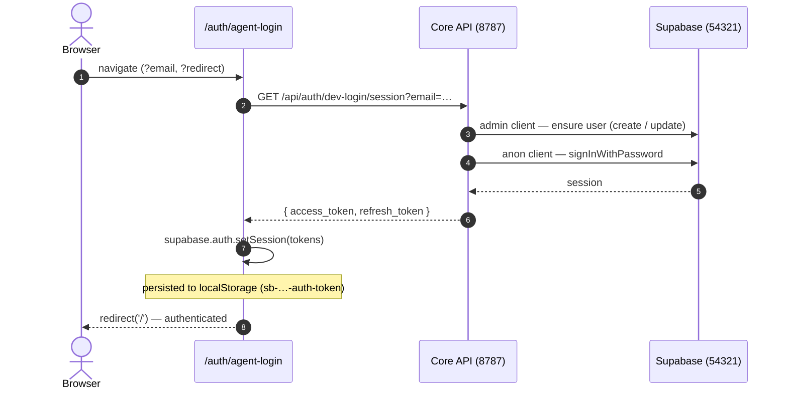

# Agent login

`/auth/agent-login` signs a browser into the app without entering credentials and
without exposing any secret to the client. It is intended for headless and
preview browsers (for example the Claude Code `preview_*` tools or Chrome MCP)
and for local automation. End-to-end tests in the `e2e/` suite use the real login
form and reuse a cached session instead.

The route is **local-only** and unavailable outside development; see
[Security gates](#security-gates).

## How it works

The route is a two-part handshake between a frontend page
(`packages/auth-ui/src/routes/agent-login-page.tsx`) and a backend endpoint
(`apps/core/src/api/routes/auth/dev-login-routes.ts`).



1. The browser navigates to `/auth/agent-login`, optionally with `?email=<addr>`
   and `?redirect=<path>`.
2. The page requests `GET /api/auth/dev-login/session`. The core API:
   - **ensures the user** through the Supabase service-role (admin) client —
     creating it with `email_confirm: true`, or resetting its password to
     `ENGENTY_DEV_PASS` if it already exists;
   - **mints a session** through the anon client (`signInWithPassword`) and
     returns `{ access_token, refresh_token, email }`.
3. The page calls `supabase.auth.setSession(...)`, which stores the session in
   `localStorage` under `sb-<ref>-auth-token` and redirects into the app.

The dev password never leaves the server; only scoped tokens are returned to the
browser.

### Endpoints

| Endpoint | Purpose |
| --- | --- |
| `GET /api/auth/dev-login/status` | Reports whether the bypass is available, with the default email. |
| `POST /api/auth/dev-login` | Ensures the user; the caller then signs in through the `/auth/dev-login` form. |
| `GET /api/auth/dev-login/session` | Ensures the user and mints a session. Used by `/auth/agent-login`. |

## Configuration

The bypass is driven entirely by server-side variables read by the core API.

| Variable | Purpose | Required |
| --- | --- | --- |
| `ENGENTY_DEV_PASS` | Dev password and the feature switch. When unset, the endpoints return `404`. | Yes |
| `SUPABASE_URL` | Connection target for the admin and anon clients (`http://127.0.0.1:54321`). | Yes |
| `SUPABASE_SERVICE_ROLE_KEY` | Admin client, used to create or update the user. | Yes |
| `SUPABASE_ANON_KEY` | Anon client, used to mint the session. Falls back to `VITE_SUPABASE_ANON_KEY`. | Yes (or the VITE fallback) |
| `ENGENTY_DEV_EMAIL` | Default email when `?email=` is omitted. | No |
| `ENGENTY_DEV_PASS_BASE_URL` | Overrides the allowed local host. See [below](#engenty_dev_pass_base_url). | No |

The browser additionally requires `VITE_SUPABASE_URL` and `VITE_SUPABASE_ANON_KEY`
for its own Supabase client. `VITE_ENGENTY_DEV_PASS` and `VITE_ENGENTY_DEV_EMAIL`
are not used by agent login; they only prefill the older `/auth/dev-login` form.

The core API (port 8787) and Supabase (port 54321) must be running (`pnpm dev`).

## Security gates

All three endpoints are gated by `isDevLoginAvailable`, which requires every one
of the following:

1. **`ENGENTY_DEV_PASS` is set.** The feature is off by default.
2. **`NODE_ENV` is not `production`.** The endpoints are unavailable in any
   production build.
3. **The request host is local.** Every host-bearing signal on the request —
   `X-Forwarded-Host`, then the request URL host (`Host` header) — must resolve
   to the allowed host. The default is `localhost`, which also matches
   `*.localhost` (so the portless gateway `engenty.localhost` qualifies) and the
   loopback addresses `127.0.0.1` and `::1`.

The gates are independent layers. A deployed host with `ENGENTY_DEV_PASS` set by
mistake still returns `404`, because both the host gate and the `NODE_ENV` gate
reject it; a request such as `https://app.example.com/api/auth/dev-login/session`
never reaches the bypass.

### `ENGENTY_DEV_PASS_BASE_URL`

Set this to widen the allowed host for a non-standard local hostname. It accepts
a base URL or a bare host; only the hostname is used.

```bash
ENGENTY_DEV_PASS_BASE_URL=https://dev.mybox.test
ENGENTY_DEV_PASS_BASE_URL=dev.mybox.test
```

The value replaces `localhost` as the allowed host; its subdomains and the
loopback addresses remain permitted. It does not relax the `NODE_ENV` gate.

## Usage

### Preview and Chrome MCP browsers

Navigate to the route on the origin under test:

```
https://engenty.localhost/auth/agent-login?email=you@example.com   # portless gateway
http://localhost:5173/auth/agent-login?email=you@example.com       # vite dev server
```

> **Initial-load timing.** If the route is opened before the application has
> finished bootstrapping, the session is not applied and the app redirects to
> `/auth/login`. Load the application first, then navigate to
> `/auth/agent-login`.

### Playwright

Mint a session server-side and inject the tokens as Playwright `storageState`:

```bash
curl -s "http://localhost:5173/api/auth/dev-login/session?email=you@example.com"
# → { access_token, refresh_token, email }
# Store under the localStorage key "sb-<ref>-auth-token" for the target origin.
```

### Origins and sessions

Sessions are stored per origin. The session is held in `localStorage` keyed to
the origin, so a session created on `http://localhost:5173` is not visible on
`https://engenty.localhost`. Authenticate on the same origin the application is
loaded from.

## Troubleshooting

| Symptom | Cause |
| --- | --- |
| `404` from `/api/auth/dev-login/session` | `ENGENTY_DEV_PASS` is unset, `NODE_ENV=production`, or the request host is not local. |
| Redirected to `/auth/login` | The route was opened before the app finished bootstrapping. Load the app first, then the route. |
| Authenticated on one origin but not another | Sessions are per origin. Authenticate on the origin in use. |
| `500 Supabase not configured` | `SUPABASE_URL`, the service-role key, or the anon key is missing. |
