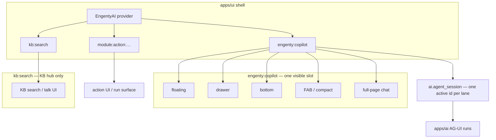

# Active copilot v1 — one copilot, many view modes

> **Naming (2026-05-28):** Client AG-UI controller vocabulary: **`hostKey`** (was `bindingKey`), **`AgentHost`** (was `EngentyAgentLane` / “lane”), **`HostConfig`** (was `EngentyAgentBinding`), **`useAgentHost`**, **`useAgentHostConfig`**, **`configureHost`**. Mount component stays **`EngentyAgent`**. See vocabulary map in `.cursor/plans/agenthost_rename_cutover_213d5a73.plan.md`.

> **Consumer API (2026-05-28):** `ActiveCopilotProvider` (mount only) + `useCopilotThreadBinding`, `useEngentyThreads`, `useAgentHost`, `useCopilotThreadActions`. Retired: `useActiveCopilot`, `activeCopilotThreadId`, copilot-only last-active storage, `steady-*`.

**Status:** product decisions signed off · **implementation:** single-controller rewrite landed (2026-05-26)
**Date:** 2026-05-25 (decisions) · 2026-05-26 (greenfield rewrite)
**Supersedes (partially):** split drawer/panel host policy in global-agent-provider work (retired `copilot:drawer` / `copilot:panel`) for the **main product copilot** only  
**Related:** [GOAL.md](./GOAL.md) · [global-agent-provider/GOAL.md](./global-agent-provider/GOAL.md) · [ag-ui-apps-ai-session.md](../../../docs/content/dev/ai-agents/ag-ui-apps-ai-session.md)

## Architecture (single controller, 2026-05-26)

The active main copilot is driven by **one** app-root controller in `@engenty/ai-ui`:

- [`active-copilot-controller.ts`](../../../packages/ai-ui/src/copilot/active-copilot-controller.ts) — pure binding rules, new-chat generation, stable session key.
- [`copilot-thread-binding-provider.tsx`](../../../packages/ai-ui/src/copilot/copilot-thread-binding-provider.tsx) — route → `activeThreadId`, URL sync, generation bump; persists via `engenty:threads:active` only.
- [`active-copilot-provider.tsx`](../../../packages/ai-ui/src/copilot/active-copilot-provider.tsx) — mounts `CopilotThreadBindingProvider` + one `EngentyAgent` for `engenty:copilot` (no React context facade).
- [`AppActiveCopilotProvider`](../../../apps/ui/src/copilot/app-active-copilot-provider.tsx) wires the provider at app root so drawer + full-page chat compose the same granular hooks.

The previous distributed stack (lane coordinator, drawer-session hook, dev guard module, full-page `useAgentChatController`, `AgentChatProvider`, split drawer/panel bindings) was deleted in the same branch — no parallel paths.

**Mount rule:** Only **`engenty:copilot`** is global in `apps/ui`. KB (`kb:search`), module actions (`{moduleId}:action:…`), and Chatbot mount **`EngentyAgent` inside `modules/*`** — never beside `AppLayout` in core.

---

## Problem (historical — fixed 2026-05-25)

Before active copilot v1, the product copilot was split into **two runtime lanes**:

| Lane | Binding key | Mount | When active |
|------|-------------|-------|-------------|
| Global drawer | `copilot:drawer` | `apps/ui` `CopilotProviderContent` | All routes **except** dedicated chat / KB hub chat |
| Full-page chat | `copilot:panel` | `modules/engenty-copilot` `chat-page.tsx` | `/module/engenty-copilot/chat/*` only |

Switching between drawer and full-page **unmounts one lane and mounts the other**. Session continuity depends on `stableSessionKey` affinity and localStorage — not on a single shared controller. Two UI stacks (`CopilotDrawer` vs `AgentChatPanel`) diverge in header, debug chrome, and session UX.

That contradicted the product goal: **one active copilot** that follows the user, works through backend and frontend tools, navigates the app, and stays aware of where the user is.

---

## Product decisions (signed off)

| # | Topic | Decision |
|---|--------|----------|
| 1 | **Main copilot binding key** | **`engenty:copilot`** — retire `copilot:drawer` and `copilot:panel` |
| 2 | **Knowledge Base search / talk** | **Separate binding** — **`kb:search`** in **`modules/knowledge-base`** (`EngentyAgent` on hub chat page). Not merged into `engenty:copilot`. Retired **`copilot:kb-hub`**. Agent id **`knowledge-base.manager`** until optional `kb_search` split. |
| 2b | **Sessions per user** | **Many** `ai.agent_session` rows per user; **one active `threadId` per `bindingKey`** (not one session ever per user). Session list switches which server session the lane binds. |
| 3 | **Session while navigating** | **One ongoing transcript** — Contacts → Tasks → etc. updates `routeContext` only; **no** new server session on route change. New session only on explicit “new chat” or session-list selection |
| 4 | **Full-page URL** | **One chat** — URL deep-links `threadId` on the shared `engenty:copilot` lane; drawer and full-page always show the same active session |
| 5 | **Multi-window** | **Deferred** — each browser tab = own lane; no cross-tab sync in v1 |
| 6 | **Visible UI slot** | **One slot at a time** — opening full-page chat **closes** floating drawer / floating card chrome; layout switches, lane unchanged |
| 7 | **`contribution.requestedAgentId`** | **C — dev warn/block** on **`engenty:copilot`**. Ignored at runtime; starter prompts + apply still work. **`requestedAgentId` must not switch agent** on the main copilot binding. |
| 8 | **Module action buttons** | **Not copilot** — task-run-style **action lanes** with semantic **`bindingKey`**: `{module}:action:{actionId}` or `{module}:action:{actionId}:{entityId}`. Retire **`copilotLaunchId`** / **`global-copilot:*`** store hijack on main lane. |
| 9 | **Model chooser** | **Deferred** — UI detail; tenant/default model for v1 unless product revisits |
| 10 | **Full-page entry UX** | Open **last active** session on **`engenty:copilot`** (same as drawer). User starts fresh via explicit **New chat** only — not auto-`/new` on every visit |

**Distinction:** `bindingKey` **`engenty:copilot`** (UI lane handle) vs `agentId` **`engenty.copilot`** (Mastra/agent registry id on `apps/ai`). **Action buttons** use **`{module}:action:…`** lanes — not **`engenty:copilot`**.

---

## Decision

### One copilot (main product lane)

There is **exactly one** main product copilot instance per authenticated browser tab:

- **One** `EngentyAgent` lane: **`bindingKey="engenty:copilot"`**
- **One** AG-UI session controller for that lane
- **One** canonical `ai.agent_session.id` active at a time (unless the user explicitly picks another session or starts “new chat”)
- **One** agent type for v1: **`agentId="engenty.copilot"`**

View changes (floating card, right drawer, bottom dock, sparkles button, full-page module route) are **presentation only**. They must not create, remount, or swap the main agent lane.

**Exception:** KB hub search/talk uses lane **`kb:search`** with agent **`kb_search`** (search-oriented tools).

### One UI slot

At any moment **one** copilot surface is visible for the main lane:

| View mode | `CopilotDockMode` (when open) | Route note |
|-----------|-------------------------------|------------|
| Floating card | `floating` | Shell routes (not full-page chat primary) |
| Right drawer | `drawer` | Same |
| Inline sidebar | `sidebar` | Same |
| Bottom composer strip | `bottom` | Same |
| Sparkles / compact launcher | `mini-floating` + closed | Same |
| **Full-page chat** | Shell copilot **closed** | `/module/engenty-copilot/chat/*` — only full-page chrome visible |

Navigating to full-page chat must **close** floating / drawer / bottom chrome (`setOpen(false)` or equivalent). Returning to a shell route restores the last dock mode from `copilot.layout` user setting.

Full-page chat is **not** a second copilot. It is the **`engenty:copilot`** lane with module chrome (session list, breadcrumbs, wider transcript). On entry: **resume last active session** for that lane (same `threadId` as drawer had). URL `/chat/:threadId` deep-links when present; otherwise bind last active from session list / lane state — **not** forced `/new`. **New chat** remains an explicit user action.

### AG-UI stays the wire

No protocol fork. Runs go through `apps/ai` `POST /ai/v1/threads/:threadId/runs`. Message authority rules from Track B remain:

- `MESSAGES_SNAPSHOT` → full replace
- Server owns message ids
- `pendingSend` is in-run UI only
- `RunAgentInput.threadId === threadId`

### Module contributions — no agent swap (v1)

Module copilot contributions (`UiCopilotContribution`) remain for:

- Starter prompts
- Apply / artifact handlers
- Page launch metadata (`?copilot=open`, scope for routing)

**`requestedAgentId` on contributions:** **do not** apply to **`engenty:copilot`**. In **development**, **warn or fail** when a contribution sets `requestedAgentId` and the host would bind the main copilot binding (`engenty:copilot`) (dev-only guard; starter prompts + apply unchanged).

**Later:** specialist agents via Mastra delegation **or** dedicated action lanes — not chooser / `requestedAgentId` swaps on the active copilot.

### Module action buttons — not copilot (v1 direction)

Past confusion: **Enhance**, **Work on task**, and similar **buttons are not the active copilot**. They are **scoped action runs** — closer to **task runs** than chat-with-the-global-assistant.

| Wrong (retire) | Right |
|----------------|--------|
| Open copilot drawer with `copilotLaunchId` | **`EngentyAgent` inside the module** (e.g. `EnhanceContactPanel`) |
| Mount KB/action agents in `apps/ui` next to `AppLayout` | Module route/page owns the boundary |
| `requestedAgentId` switches main copilot agent | Separate `bindingKey` + `agentId` on module-local `EngentyAgent` |

**Binding key convention:**

```
{module}:action:{actionId}              — list / batch / global scope
{module}:action:{actionId}:{entityId}   — single entity (e.g. one contact)
```

**Examples:**

| Action | `bindingKey` |
|--------|----------------|
| Enhance one contact | `contacts:action:enhance:{contactId}` |
| Bulk enhance / review queue | `contacts:action:enhance:list` |
| (pattern for other modules) | `{module}:action:{actionId}[:{entityId}]` |

Each module action agent:

- **`EngentyAgent` mounted in `modules/<name>/ui/…`** — not in `apps/ui`
- Own **`bindingKey`**, own **`threadId`**, own transcript via `EngentyAI` registry
- Does **not** mutate **`engenty:copilot`**
- UI may be inline panel, modal, or run observer — product per action

Retire **`copilotLaunchId`** in scope for active-copilot opens. Migrate contacts/tasks button flows to action lanes in follow-up work (may overlap Phase B/C).

### Shared awareness

The active copilot receives **live route context** on every navigation:

- `routeContext` from app shell (`moduleId`, `pathname`, `routeKey`, `scope`)
- `AgentUiStateSnapshotV1` on each run (Phase 4 — wire consistently)
- Registered frontend tools (`navigate`, `open-copilot`, module tools via plugin registry)

Route changes update context **without** remounting the lane and **without** starting a new session.

---

## Target architecture



### Retire (main copilot)

| Today | After v1 |
|-------|----------|
| `bindingKey="copilot:panel"` on `chat-page.tsx` | Full-page uses **`useEngentyAgent("engenty:copilot")`** |
| `bindingKey="copilot:drawer"` | **`engenty:copilot`** |
| `CopilotProviderContent` returns `null` on dedicated chat routes | Main lane **always** mounted; full-page closes shell chrome only |
| Separate `AgentChatPanel` session stack vs drawer inject | One `CopilotPanelContent` (or thin wrappers) |
| Drawer vs panel session sync via affinity | One reducer — no sync needed |
| Per-route `stableSessionKey` for main copilot | **User-scoped active session**; route in `routeContext` only |
| Agent chooser on drawer / full-page | Hidden for v1; locked to `engenty.copilot` |
| `copilotLaunchId` + `global-copilot:*` store on drawer | **Action lanes** `{module}:action:…`; no launch id on **`engenty:copilot`** |
| `requestedAgentId` from contributions on main copilot binding (`engenty:copilot`) | Dev **warn/block**; runtime ignores on **`engenty:copilot`** |

### Keep (unchanged for v1)

| Piece | Reason |
|-------|--------|
| `EngentyAI` at app shell | Shared transport, tools, query keys |
| `modules/engenty-copilot` as UI module | Routes, session list, full-page chrome |
| `packages/ui-core` drawer surfaces | Dock mode layout |
| **`kb:search`** on KB hub chat | Separate lane; **`agentId="kb_search"`** + search tools |
| Track B message authority | Non-negotiable |
| Task run observer / other lanes | Not the main copilot |

---

## Session rules (v1)

1. **Active session** — one canonical `threadId` on **`engenty:copilot`** at a time.
2. **Navigation** — changing module/route **keeps** the same transcript; only `routeContext` / UI state snapshot change.
3. **URL on full-page** — `/module/engenty-copilot/chat/:threadId` deep-links when navigated; otherwise bind **last active** session on **`engenty:copilot`**. `/new` only via explicit **New chat**.
4. **Shell hidden** — drawer/floating closed while full-page chat is primary; lane stays mounted (`hydrateEnabled` policy unchanged).
5. **New chat** — explicit user action only (session list, header “new chat”, `/chat/new`) — not automatic on route change.
6. **KB hub** — **`kb:search`** owns its own session(s); does not hijack **`engenty:copilot`** transcript.
7. **No client transcript merge** between binding keys.
8. **Many server sessions** — user history is unbounded; each lane holds one **active** `threadId`; switching sessions rebinds that lane only.

### Implementation note (affinity)

Today `resolveCopilotWorkContextStableSessionKey` includes normalized route scope. For active copilot v1, **Phase B** should narrow main-lane affinity to **tenant + user** (and explicit “new chat” generation on `/new`), not per-module route keys — otherwise Q3 is violated.

---

## Multi-pane: chat tabs, kanban, parallel agents (future)

**Active copilot v1** ships **one** main binding: **`engenty:copilot`**. Multi-tab / kanban / split-pane is a **later** product mode built on the same `EngentyAI` registry — not numbered suffixes on the default binding.

### Three-level model (keep these separate)

| Concept | Meaning | Example |
|---------|---------|---------|
| **`bindingKey`** | Client UI controller slot — one AG-UI reducer per key | `engenty:copilot`, `kb:search`, `engenty:copilot:tab:{tabId}` |
| **`threadId`** | Durable server transcript (`ai.agent_session.id`) | UUID from `apps/ai` |
| **`agentId`** | Which agent config/tools run | `engenty.copilot`, `kb_search` |

**Rule:** one **active** `threadId` per **bindingKey**. A user has **many** server sessions over time; the session list picks which id is bound to **`engenty:copilot`** right now.

### Is it `engenty:copilot:0`, `:1`, `:2`?

**Not recommended** for product tabs or kanban cards:

- Indices shift when a tab/card closes → wrong lane reuse, leaked state, resume bugs.
- No stable URL or deep link.
- Hard to map “this card” ↔ “this transcript” after reorder.

**Prefer stable opaque ids:**

| Use case | Binding key pattern | Session |
|----------|---------------------|---------|
| Default active copilot (v1) | **`engenty:copilot`** | One active `threadId`; view modes share this lane |
| In-app chat tabs (future) | **`engenty:copilot:tab:{tabId}`** | `tabId` = client uuid when tab opened; each tab its own `threadId` |
| Kanban / workspace card (future) | **`engenty:copilot:card:{cardId}`** or **`task:assist:{taskId}`** | One lane per visible card |
| Module action button | **`{module}:action:{actionId}[:{entityId}]`** | Scoped run; **not** **`engenty:copilot`** |
| KB hub search/talk | **`kb:search`** | KB-scoped sessions; **`kb_search`** agent |

(`tabId` / `cardId` are **UI ids**, not server session ids.)

### Multiple “open chats” — two different products

**A) Browser tabs (multi-window — deferred v1)**  
Each browser tab = separate React tree = separate **`engenty:copilot`** lane instance. No sync. Same pattern as today, explicit in decision #5.

**B) Multiple chats inside one browser tab (tabs / kanban — future)**  
Mount **multiple** `<EngentyAgent bindingKey="…">` boundaries (or one dynamic registry entry per pane). Each binding:

- Own reducer + SSE stream
- Own `threadId`
- Only **one** may use the global floating/drawer **shell slot** at a time unless UI is explicitly split (side-by-side / kanban columns)

**C) Session list without multi-pane (v1)**  
Still **one** binding **`engenty:copilot`**. User switches **which** server session is active (like switching threads in Slack) — not parallel visible transcripts.

### v1 vs future

| Phase | Main copilot | Multi-pane |
|-------|--------------|------------|
| **v1 (Phase B)** | Single **`engenty:copilot`**; session list switches active `threadId` | Out of scope |
| **Future** | Default lane unchanged | Add **`engenty:copilot:tab:{uuid}`** (or workspace-scoped keys) per visible pane |

Document multi-pane policy in [global-agent-provider/GOAL.md](./global-agent-provider/GOAL.md) when implementing — align with existing sketch **`copilot:tab:{tabId}`**, renamed to **`engenty:copilot:tab:{tabId}`** for namespace consistency.

---

## Implementation phases

### Phase A — Decision sign-off

- [x] Product decisions recorded (binding key, KB, session, URL, multi-window, UI slot)
- [x] KB hub stays separate (**`kb:search`** / **`kb_search`**)

### Phase B — Single lane cutover

- [x] One `EngentyAgent` mount: **`bindingKey="engenty:copilot"`** in app shell — `39ec8653`
- [x] Remove dedicated-route provider unmount in `CopilotProviderContent` — `39ec8653`
- [x] Full-page route closes shell copilot chrome (floating/drawer/bottom) — `39ec8653`
- [x] Refactor `chat-page.tsx` to consume shared lane — no second `EngentyAgent` — `39ec8653`
- [x] URL `threadId` / `/new` flow updates shared lane props — `39ec8653`
- [x] Remove `copilot:panel` / `copilot:drawer` product mounts — `39ec8653`
- [x] Adjust main-lane session affinity (user-scoped, not per-route) — `39ec8653` (`resolveActiveCopilotStableSessionKey`)
- [x] Full-page opens **last active** session on shared lane (not forced `/new`) — `39ec8653`
- [x] Tests: drawer → full-page → drawer keeps same `threadId`; full-page closes floating — `39ec8653`

### Phase C — Agent + chrome lockdown

- [x] Hard-code `agentId="engenty.copilot"` on **`engenty:copilot`** — `b6dad3be` (`ACTIVE_COPILOT_AGENT_ID`)
- [x] Dev guard: warn/block `contribution.requestedAgentId` when binding main copilot binding (`engenty:copilot`) — `b6dad3be` (`useActiveCopilotRequestedAgentIdGuard`)
- [~] Remove / hide agent chooser on main copilot surfaces (model chooser **deferred**) — agent-only picker gone (`b6dad3be` drops `agent-chooser.tsx`, `3d1aca95` retires new-chat split menu); drawer's combined `agentSessionChooserEnabled` still surfaces an agent affordance pending session-only redesign
- [x] Gate debug payloads behind developer mode — `3d1aca95` (`isEngentyDeveloperModeUiEnabled` on `CopilotDebugDetails`)
- [x] Converge header/session UX where cheap — drawer + full-page share controller via `useActiveCopilotLaneProps`
- [x] Stop routing button launches through `copilotLaunchId` on main lane (migrate to action lanes incrementally) — `2812c67f`; see `modules/contacts/ui/components/enhance-contact-panel.tsx`

### Phase D — Awareness hardening

- [ ] Ensure `AgentUiStateSnapshotV1` on every run
- [ ] Verify frontend tool catalog for navigate / shell actions
- [ ] Manual E2E: [manual-e2e-matrix.md](./manual-e2e-matrix.md) Track B rows

### Phase F — Greenfield single-controller rewrite (2026-05-26)

- [x] Add [`active-copilot-controller.ts`](../../../packages/ai-ui/src/copilot/active-copilot-controller.ts) with one outcome-oriented test file
- [x] Add [`active-copilot-provider.tsx`](../../../packages/ai-ui/src/copilot/active-copilot-provider.tsx) + granular consumer hooks
- [x] Mount `ActiveCopilotProvider` at app root via [`AppActiveCopilotProvider`](../../../apps/ui/src/copilot/app-active-copilot-provider.tsx)
- [x] Rewrite drawer layer + chat-page / chat components as dumb views over the new context
- [x] Delete legacy lane coordinator, drawer-session hook, dev guard, full-page chat controller, chat provider, pending-navigate, new-chat generation helpers, floating session selection, full-page store id, global launcher
- [x] Trim `EngentyAgent` (drop main-copilot childBinding workarounds and sibling-subtree pending-lane fallback); keep `useEngentyAgentBinding` for KB hub / module action lanes (module-local mounts)
- [x] Update [`scripts/check-copilot-agent-provider-cutover.mjs`](../../../scripts/check-copilot-agent-provider-cutover.mjs) to block re-imports of the retired modules
- [x] Drop orphaned chat helpers superseded by the provider (`use-chat-queries`, `use-chat-delete-session`, `use-chat-route-sync`, `use-chat-agent-options`, `use-active-session-list-status`, `use-agent-session-realtime`, `copilot-live-cache`, `agent-session-active-status`)
- [ ] Follow-up: re-wire optional Supabase Realtime cache invalidation for `ai.agent_session` and optimistic in-stream session-list status indicators inside `ActiveCopilotProvider` if/when needed

### Phase E — Docs

- [x] Update [ag-ui-apps-ai-session.md](../../../docs/content/dev/ai-agents/ag-ui-apps-ai-session.md) — lane table reflects `engenty:copilot` / `kb:search` / `{module}:action:…`
- [x] Update [global-agent-provider/GOAL.md](./global-agent-provider/GOAL.md) lane table — example block + multi-agent scenarios + grounding wrappers row reflect Phase B/C/E reality
- [~] Rename KB lane **`copilot:kb-hub`** → **`kb:search`**; register **`kb_search`** agent + search tools — lane renamed; agent stays `knowledge-base.manager` until a separate slice splits the search-only tool subset
- [x] Append milestone to [agentic-framework-tracker.md](../../../docs/dev/wip/agentic-framework-tracker.md) — 2026-05-25 entry

---

## Non-goals (v1)

- Module specialist agents in the main copilot chooser
- **`requestedAgentId`** switching agent on **`engenty:copilot`** (dev guard only)
- ~~Module **action buttons** sharing **`engenty:copilot`** transcript (`copilotLaunchId` pattern)~~ — retired (dedicated `{module}:action:…` lanes)
- Model chooser product spec (deferred UI)
- Multi-pane chat tabs on the active copilot
- Multi-window / cross-tab session sync
- Merging KB hub into **`engenty:copilot`** ( **`kb:search`** lane stays separate)
- Multi-pane chat tabs / kanban parallel lanes ( **`engenty:copilot:tab:*`** — future)
- CopilotKit runtime replacement
- Client-side transcript dedupe or dual hydrators

---

## Verification (definition of done)

- [x] Exactly one `EngentyAgent` boundary for main copilot: **`engenty:copilot`** — enforced by `scripts/check-copilot-agent-provider-cutover.mjs`
- [x] `rg 'copilot:panel'|'copilot:drawer'` absent from product mounts (tests/docs migration notes OK) — cutover script blocks regressions
- [x] Full-page navigation closes floating/drawer; only one visible slot — `apps/ui/src/components/copilot-provider-content.tsx`
- [ ] Navigate Contacts → Tasks: same `threadId`, updated `routeContext` — needs E2E walkthrough
- [ ] Floating → full-page → floating: same transcript, no duplicate user rows — needs E2E walkthrough
- [x] `/chat/new` → first send → one server id → URL navigate when idle
- [x] Agent locked to `engenty.copilot` on main lane — `b6dad3be` / `3d1aca95`
- [~] KB hub uses **`kb:search`** / **`kb_search`** independently — lane renamed (`kb:search`); `kb_search` agent split is a follow-up
- [ ] Manual E2E matrix rows signed off — pending walkthrough

---

## References

| Doc | Relevance |
|-----|-----------|
| global-agent-provider/RFC.md | Affinity policy for user-scoped active copilot session |
| [active-copilot-controller.ts](../../../packages/ai-ui/src/copilot/active-copilot-controller.ts) | Pure binding rules + `/new` generation id |
| [active-copilot-provider.tsx](../../../packages/ai-ui/src/copilot/active-copilot-provider.tsx) | App-root controller; owns one `EngentyAgent` for `engenty:copilot` |
| [app-active-copilot-provider.tsx](../../../apps/ui/src/copilot/app-active-copilot-provider.tsx) | Mounts the provider at app root so drawer + full-page share context |
| [copilot-provider-content.tsx](../../../apps/ui/src/components/copilot-provider-content.tsx) | Thin host: renders `CopilotDrawerLayer` off-route; shell close on full-page |
| [chat-page.tsx](../ui/pages/chat-page.tsx) | Dumb view over granular hooks |
| [kb-hub-chat-page.tsx](../../knowledge-base/ui/pages/kb-hub-chat-page.tsx) | Separate lane (`kb:search`); uses `useEngentyAgentBinding` |
| contacts/ui/components/enhance-contact-panel.tsx | Reference **`{module}:action:…`** lane: `contacts:action:enhance:<contactId>` |
