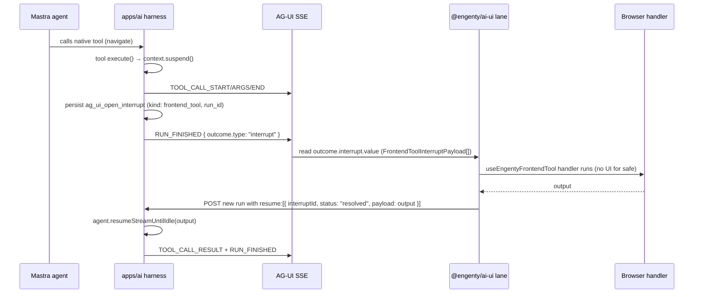

# Frontend tool interrupt/resume (AG-UI native)

**Status:** native suspend/resume (2026-06-15) — replaced the earlier hybrid dispatch path

## Summary

All browser frontend tools now use the **same native AG-UI suspend/resume path**. The model
calls a native Mastra tool by name; the tool's `execute()` calls `context.suspend()`; the harness
persists `ag_ui_open_interrupt` and ends the run with a `RUN_FINISHED` interrupt outcome; the
browser executes the handler and resumes the run with a new `RunAgentInput` carrying `resume[]`.
There is **no** `invoke_frontend_tool` meta-tool, **no** in-memory waiter, and **no**
`POST .../frontend-tools/:callId/result` side-channel.

| Safety | Path | Reload-safe |
|--------|------|-------------|
| `safe` | Native suspend → handler **auto-executes** in the browser (no UI) → resume | Yes — interrupt hydrates from session detail |
| `requires_confirmation` | Native suspend → **chooser/confirm card** → handler executes → resume | Yes — confirm card hydrates from session detail |

Both paths are identical on the wire. The only difference is whether the browser shows confirmation
UI before running the handler.

## Safe frontend tool sequence (`navigate`, theme, locale)

The same `toolCallId` is the UI row identity for the whole run. The interrupt payload carries the
`run_id` of the suspended Mastra run, which ties the browser result back to the correct run on resume.

## Flow (confirmation tools)

1. Agent calls a native frontend tool whose `safety` is `requires_confirmation`.
2. Tool `execute()` calls `context.suspend()`; harness emits `TOOL_CALL_*`.
3. Harness persists `ag_ui_open_interrupt` with `kind: "frontend_tool"` (including `run_id`) and ends
   the run with a `RUN_FINISHED` interrupt outcome.
4. Client reads `outcome.interrupt.value` and shows `FrontendToolConfirmCard` (or
   `CopilotOpenInterruptBanner`) instead of auto-executing.
5. User approves → host runs the `useEngentyFrontendTool` handler locally →
   `resumeInterrupt({ interruptId, status: "resolved", payload: <handler output> })`.
6. Resume run calls `agent.resumeStreamUntilIdle(output)`, emits `TOOL_CALL_RESULT` for the original
   `tool_call_id`, and the agent continues.

## Key files

- Contract: `packages/ag-ui-bridge/src/engenty-open-interrupt.ts` (`buildFrontendToolOpenInterrupt`, `readAgUiOpenInterrupt`)
- Tool definition: `packages/ag-ui-bridge/src/frontend-tools.ts` (`createFrontendToolDefinition`)
- Harness suspend/resume: `apps/ai/src/ai/sessions/harness.ts` (`tool-call-suspended` routing, `resumeStreamUntilIdle`)
- Resume formatting: `apps/ai/src/ai/threads/interrupts.ts`, `apps/ai/src/api/agent-session-runs-routes.ts`
- Client handler: `packages/ai-ui/src/ag-ui/use-engenty-frontend-tool.ts`
- UI: `packages/ai-ui/src/components/copilot/interrupts/frontend-tool-confirm-card.tsx`, `copilot-open-interrupt-banner.tsx`

## Pilot tool

`contacts_apply_draft_patch` on the contact edit page (`safety: "requires_confirmation"`).

## Manual QA

See manual E2E matrix row 14 — confirm UI, approve/reject, reload while confirm visible, resume after reload.
