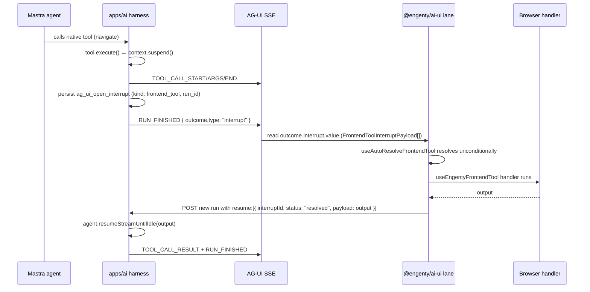

# Frontend tool interrupt/resume (AG-UI native)

**Status:** shipped. Native Mastra suspend/resume; no per-tool confirmation UI.
Canonical catalog notes: [`packages/ag-ui-bridge/docs/frontend-tools.md`](../../../packages/ag-ui-bridge/docs/frontend-tools.md).

## Summary

Browser frontend tools share one AG-UI suspend/resume path. The model calls a
native Mastra tool by name; `execute()` calls `context.suspend()`; the harness
persists `ag_ui_open_interrupt` and ends the run with a `RUN_FINISHED` interrupt
outcome; the browser runs the handler and resumes with a new `RunAgentInput`
carrying `resume[]`.

There is **no** `invoke_frontend_tool` meta-tool, **no** in-memory waiter, and
**no** `POST …/frontend-tools/:callId/result` side-channel.

There is also **no approval branch** for frontend tools.
`useAutoResolveFrontendTool` resolves every `frontend_tool` interrupt
unconditionally — suspend is transport (park the run so the browser can work),
not a gate. Guard destructive work via connector approval policies, backend tool
approval, or the agent prompt.

**Sandbox command confirmation** is a separate interrupt kind
(`SandboxCommandConfirmCard`) and is unaffected.

## Sequence

The same `toolCallId` is the UI row identity for the whole run. The interrupt
payload carries the suspended Mastra `run_id` for resume. Interrupts hydrate from
thread detail (reload-safe).

## Key files

| Layer | Path |
|-------|------|
| Contract | `packages/ag-ui-bridge/src/engenty-open-interrupt.ts` |
| Tool definition | `packages/ag-ui-bridge/src/frontend-tools.ts` |
| Harness suspend | `apps/ai/src/ai/sessions/interrupts.ts`, `apps/ai/src/ai/conversation/emit-interrupt.ts` |
| Resume | `apps/ai/src/ai/conversation/resume-conversation-run.ts` |
| Run routes | `apps/ai/src/api/thread-run-routes.ts`, `apps/ai/src/api/agent-run-routes.ts` |
| Client handler | `packages/ai-ui/src/ag-ui/use-engenty-frontend-tool.ts` |
| Auto-resolve | `packages/ai-ui/src/copilot/use-auto-resolve-frontend-tool.ts` |

HITL UI (`CopilotOpenInterruptBanner`) is for **decision / feedback / sandbox
command** interrupts — not frontend-tool dispatch.

## Manual QA

Smoke: trigger `navigate` (or another frontend tool) → one tool row → reload
mid-interrupt → auto-resolve + resume completes without a stuck running row.
