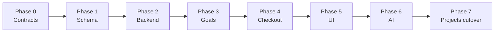

# Tasks module — implementation plan

**Status:** Phases 0–6 and 7 backend cutover **done** (2026-05); optional tails below.  
**Start:** [phase-00-baseline-and-contract-tests.md](./phase-00-baseline-and-contract-tests.md)  
**Goal:** [GOAL.md](./GOAL.md)

## Handover status (2026-05-23)

| Phase | Doc status | Reality |
|-------|------------|---------|
| 0–5 | **`done`** — exit criteria `[x]`; inline task lists kept for audit | Implemented; `pnpm --filter @engenty/tasks test` — **73 tests green** |
| 6 | **`done`** | Code complete; **manual Studio smoke** still open |
| 7 | **backend done** | Bridge + drop migration + contract tests (`requires: module.tasks`, `project-tasks-bridge`, TRASHBIN). **Deferred:** projects UI component dedup |

**Product deltas vs original plan** (document in [GOAL.md](./GOAL.md)): no subtasks/sub-goals in UI; done/cancelled tasks editable again; chat-style comments+activity tab; activity feed redesign (`format-activity*`, `AGENTS.md` card rules).

**Open tails:** Phase 6 manual Studio checkout flow; optional `apps/ai` auto-checkout on run start; projects task UI dedup; portal/inbox manual smoke (see phase-07 exit criteria).

**Verify:** `pnpm --filter @engenty/tasks test` · `pnpm --filter @engenty/projects test`

**Start here (new agent):** [README.md](./README.md) → [GOAL.md](./GOAL.md) → [AGENTS.md](../AGENTS.md) → phase doc for the area you touch.

---

## Sequencing rules (non-negotiable)

1. **Projects task data** lives in `module_tasks` via `project-tasks-bridge` (Phase 7 cutover done). Do not reintroduce `phase_tasks` or parallel task storage in `modules/projects`.
2. **Brutal cutover** — Phase 7 deletes `phase_tasks` / task routes from projects schema; no dual-write, no migration of old rows (prelaunch).
3. **Contract tests first** — Phase 0 tests define behavior that must pass at program end (tasks module + projects consumer).
4. **One phase PR mindset** — finish exit criteria before starting the next phase.
5. **Archive, don’t shim** — superseded projects task code moves to `.trash/` in Phase 7, not compatibility layers.

---

## Phase map

| Phase | Doc | Outcome |
|-------|-----|---------|
| **0** | [phase-00-baseline-and-contract-tests.md](./phase-00-baseline-and-contract-tests.md) | Contract tests, lifecycle pure functions, grep gates |
| **1** | [phase-01-module-scaffold-and-schema.md](./phase-01-module-scaffold-and-schema.md) | Package, manifest, DB schema, mandatory declaration |
| **2** | [phase-02-tasks-backend-api.md](./phase-02-tasks-backend-api.md) | DAL, HTTP routes, gateway operations, events |
| **3** | [phase-03-goals-and-lifecycle.md](./phase-03-goals-and-lifecycle.md) | Goals CRUD, status transitions, identifier allocation |
| **4** | [phase-04-checkout-and-live-runs.md](./phase-04-checkout-and-live-runs.md) | Agent checkout/release, `task_runs`, activity log |
| **5** | [phase-05-ui-hub.md](./phase-05-ui-hub.md) | `/module/tasks` hub: list, detail, goals, briefing |
| **6** | [phase-06-ai-copilot-integration.md](./phase-06-ai-copilot-integration.md) | Skills, assist agent, copilot scope, catalog ops |
| **7** | [phase-07-projects-brutal-cutover.md](./phase-07-projects-brutal-cutover.md) | Projects consumes tasks via `task_contexts`; delete legacy |



---

## Dependency graph (modules)

| Module | When | Relationship |
|--------|------|--------------|
| `tasks` | Phases 0–6 | Owner of canonical rows |
| `projects` | Phase 7 only | `requires: ["module.tasks"]`, `task_contexts` consumer |
| `engenty-copilot` | Phase 6 | Checkout + task scope in copilot |
| `inbox` | After Phase 7 (optional) | Qualify → `tasks_create` + link |

---

## Shared code lift (from projects, not duplicated forever)

| Source (projects) | Target (tasks) | Phase |
|-------------------|----------------|-------|
| `task-status-builtins.ts` | `modules/tasks/task-status-builtins.ts` | 1 |
| Task status settings UI/logic | `modules/tasks/ui/...` | 5 |
| Kanban/table/toolbar components | `modules/tasks/ui/components/...` | 5 |
| `projects-briefing-service.ts` heuristics | `tasks-briefing-service.ts` (generalized) | 5 |
| `task_comments` schema | `module_tasks.task_comments` | 1 |

**Do not copy** `phase_tasks`, project-specific portal task routes, or inbox qualification until Phase 7 rewires them.

---

## Verification commands (every phase)

```bash
pnpm --filter @engenty/tasks test
pnpm --filter @engenty/tasks build
pnpm lint
```

Phase 7 additionally:

```bash
pnpm --filter @engenty/projects test
pnpm migrations:aggregate
```

---

## UI sketches

See [dev/assets/](./assets/):

- `ui-sketch-tasks-list.png` — grouped list / kanban entry
- `ui-sketch-task-detail.png` — detail + live runs + properties
- `ui-sketch-goals-list.png` — goals hub

---

## Open questions (resolved in implementation)

- [x] Default identifier prefix: tenant `module_tasks.tenant_settings.identifier_prefix` (default `ENG`)
- [x] Keep `request` status (lifted from projects builtins; label “Client request” in locales)
- [x] Briefing: standalone `/module/tasks/briefing` tab (sidebar + module routes)
