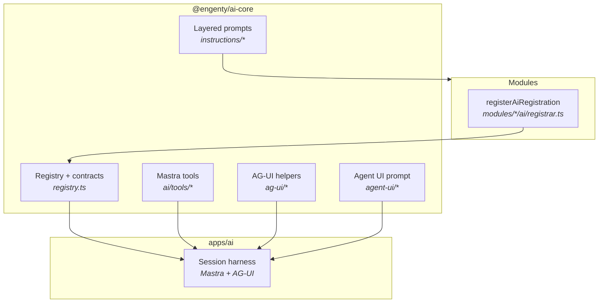

# @engenty/ai-core – Developer Docs

Developer-focused documentation for the current AI runtime package.

## Overview

`@engenty/ai-core` is the shared agentic SDK for Engenty:

- `registerAiRegistration` — module agents, actions, skills, triggers, heartbeat policies
- `AgentConfig` / `DynamicAiModuleCapability` — contracts for `apps/ai` dynamic agent assembly
- Mastra tool builders under `ai/tools/` (re-exported from `src/tools/`)
- AG-UI message helpers, agent UI prompt context, usage/model config
- Layered copilot prompts via `buildAgentLayeredPrompt` and instruction seed files

Product copilot chat runs on **`apps/ai` AG-UI**, not the retired core orchestrator (`runOrchestrator`, inbound routing, run/request/session stores). See [docs/cleanup-plan.md](docs/cleanup-plan.md) and [AG-UI on apps/ai](../../docs/content/dev/ai-agents/ag-ui-apps-ai-session.md).

For a compact docs hub, see [docs/README.md](docs/README.md).

**Cleanup:** Phases A–E complete (2026-05-29). See [docs/cleanup-plan.md](docs/cleanup-plan.md) for the retirement record.

## How-to Tutorials

| Tutorial | Description |
|----------|-------------|
| [Build tools](docs/howto-build-tools.md) | Implement tools using `ToolExecutionContext`, `callGatewayMethod`, and scope |
| [Agent Workspaces](docs/howto-workspaces.md) | Add a Mastra workspace to an agent — presets, sandbox, search |
| [Artifacts and HITL](docs/howto-artifacts-hitl.md) | Stream structured suggestions as artifacts for human-in-the-loop approval |
| [AI config](docs/howto-ai-config.md) | Configurable models and instruction seeds |
| [Declare a module's AI surface](docs/howto-define-module-ai.md) | `defineModuleAi` directory convention for agents, skills, actions, routines |
| [Agent Hooks](docs/howto-agent-hooks.md) | Compose an agent as a function with `useModel`/`useTool`/`useThreadState` instead of a static `agent.json` |

## Package Layout

```text
packages/ai-core
├── src
│   ├── index.ts
│   ├── browser.ts
│   ├── contracts.ts
│   ├── dynamic-contracts.ts
│   ├── inbound-contracts.ts
│   ├── copilot-trigger-contracts.ts
│   ├── registry.ts
│   ├── actions/loader.ts
│   ├── skills/
│   │   ├── loader.ts
│   │   ├── builtin.ts
│   │   └── seed/
│   ├── agents/
│   │   ├── agent-manifest.ts
│   │   ├── copilot-agent-manifest.ts
│   │   └── copilot-constants.ts
│   ├── catalog/json-schema.ts
│   ├── instructions/
│   │   ├── compose-agent-prompt.ts
│   │   ├── copilot-seed-files.ts
│   │   ├── registry.ts
│   │   └── resolver.ts
│   ├── ag-ui/
│   │   ├── ag-ui-messages.ts
│   │   ├── ag-ui-event-adapter.ts
│   │   └── events.ts
│   ├── agent-ui/
│   │   ├── agent-prompt-context-from-ui.ts
│   │   ├── agent-ui-frontend-tool-gating.ts
│   │   └── app-navigation-paths-prompt.ts
│   ├── runtime/
│   │   ├── initial-session-title.ts
│   │   ├── agent-thread-id.ts
│   │   └── parallel-tasks.ts
│   ├── tools/              # thin re-exports → ../ai/tools/*
│   ├── usage/
│   ├── config/
│   ├── artifacts/
│   └── models/
├── ai/tools/               # canonical tool implementations/builders
│   ├── <name>/<name>-tool.ts
│   └── context/types.ts    # ToolExecutionContext
└── docs/
```

## Runtime Architecture



## Main Entry Points

- Registration: `registerAiRegistration`, `unregisterAiRegistration`, `listActiveAiRegistrations`
- Dynamic module capability: `AgentConfig`, `DynamicAiModuleCapability`, `MastraToolDefinition`
- Registry lookup: `resolveAgentDefinitionById`, `resolveActionDefinitionById`, `resolveSkillDefinitionById`
- AG-UI: `buildAgUiMessagesFromSessionMessages`, `agUiMessageText`, `deriveInitialSessionTitleFromText`
- Agent UI prompt: `buildAgentSystemPromptFromUiState`, `formatAgentUiStateHarnessInstructions`
- Instructions: `buildAgentLayeredPrompt`, `createEngentyCopilotInstructionDocuments`, `resolveInstructionLayers`
- Usage: `recordAiUsage`, `checkUsageLimits`, `configureAiUsageStore`

## Related Docs

- [docs/README.md](docs/README.md)
- [Cleanup plan](docs/cleanup-plan.md)
- [AG-UI on apps/ai](../../docs/content/dev/ai-agents/ag-ui-apps-ai-session.md)
- [AGENTS.md](AGENTS.md)
